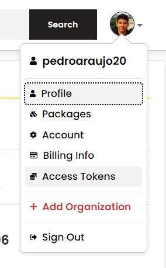
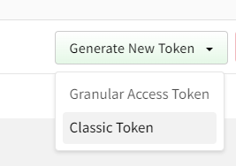
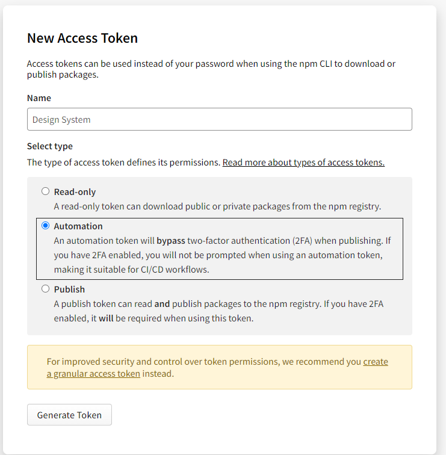

# Create Design System

This is a design system starter from scratch using TypeScript, TurboRepo, StoryBook, Stitches, Changeset, Eslint, Github Actions, Workflows.
It has all that you need to create your own design system, with release, CI/CD ready.


## Quick Overview

```sh
npm i -g @brightscript/create-design-system
npx create-design-system my-design-system
cd my-design-system
npm run dev
```

It will create a directory called `my-design-system` inside the current folder.<br>
Inside that directory, it will generate the initial project structure and install the transitive dependencies:

## Structure

```
my-design-system
├───.changeset
├───.github
│   └───workflows
└───packages
    ├───docs
    │   ├───.storybook
    │   ├───node_modules
    │   │   ├───.cache
    │   │   │   ├───.vite-storybook
    │   │   │   │   └───deps
    │   │   │   ├───sb-manager
    │   │   │   │   ├───a11y-9
    │   │   │   │   ├───essentials-actions-2
    │   │   │   │   ├───essentials-backgrounds-3
    │   │   │   │   ├───essentials-controls-1
    │   │   │   │   ├───essentials-measure-6
    │   │   │   │   ├───essentials-outline-7
    │   │   │   │   ├───essentials-toolbars-5
    │   │   │   │   ├───essentials-viewport-4
    │   │   │   │   ├───interactions-8
    │   │   │   │   ├───links-0
    │   │   │   │   └───storybook-10
    │   │   │   ├───storybook
    │   │   │   │   ├───dev-server
    │   │   │   │   └───public
    │   │   │   │       └───sb-addons
    │   │   │   │           ├───a11y-9
    │   │   │   │           ├───essentials-actions-2
    │   │   │   │           ├───essentials-backgrounds-3
    │   │   │   │           ├───essentials-controls-1
    │   │   │   │           ├───essentials-measure-6
    │   │   │   │           ├───essentials-outline-7
    │   │   │   │           ├───essentials-toolbars-5
    │   │   │   │           ├───essentials-viewport-4
    │   │   │   │           ├───interactions-8
    │   │   │   │           ├───links-0
    │   │   │   │           └───storybook-10
    │   │   │   └───vite-plugin-externals
    │   │   │       └───@storybook
    │   │   └───@vitejs
    │   │       └───plugin-react
    │   │           └───dist
    │   └───src
    │       ├───components
    │       ├───pages
    │       │   └───tokens
    │       ├───stories
    │       └───styles
    ├───eslint-config
    ├───react
    │   ├───dist
    │   └───src
    │       ├───components
    │       │   ├───Avatar
    │       │   ├───Checkbox
    │       │   ├───MultiStep
    │       │   └───TextInput
    │       └───styles
    ├───tokens
    │   ├───dist
    │   └───src
    └───ts-config
```

## Configuring your Github Pages

- On `packages/docs/.storybook/main.js` change the `config.base` to the name of your project as you created:

```js
  viteFinal: (config, { configType }) => {
    if (configType === 'PRODUCTION') {
      config.base = '/create-design-system/'
    }

    return config
  }
```

- On your repository, go to `Settings - Actions - General - Workflow permissions` and mark `Read and write permissions`

### Setup env keys to publish

- You will need to have this keys on your github project:

`
  GITHUB_TOKEN
  VERCEL_TOKEN
  NPM_TOKEN
`

- To create a `NPM_TOKEN`, go to `Access Tokens - Generate New Token - Classic Token` - Add a name and select `Automation`







- To create a `VERCEL_TOKEN`, see the doc of Vercel https://vercel.com/docs/rest-api#introduction/api-basics/authentication

- With all in hands, go to your project on github, Settings - Security - Secrets and variables - Actions - New repository secret and add each one that you created. Now everything should be ready.

### Example

This is a example of StoryBook created:

https://pedroaraujo20.github.io/design-system/
